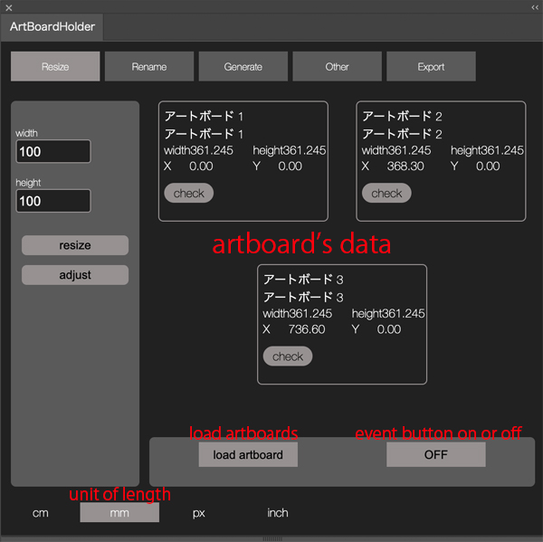
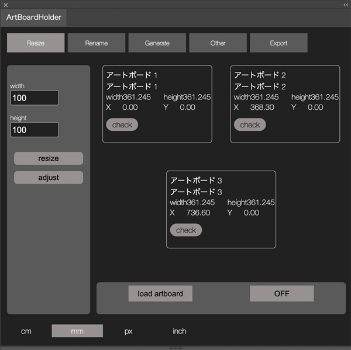
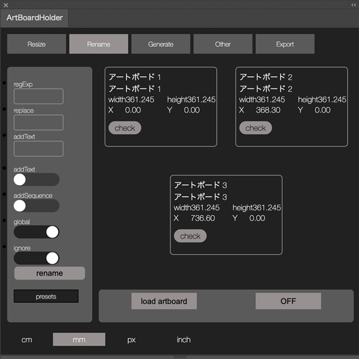
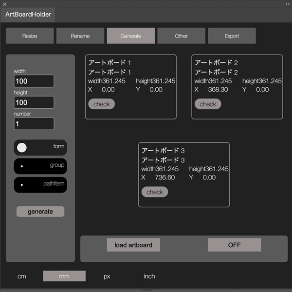
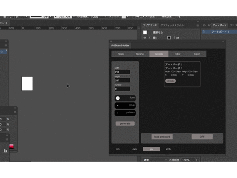
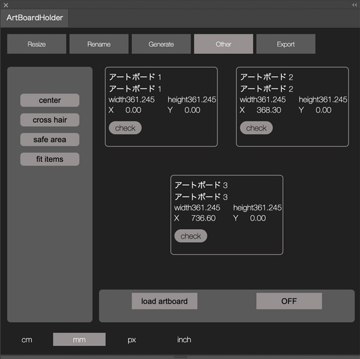
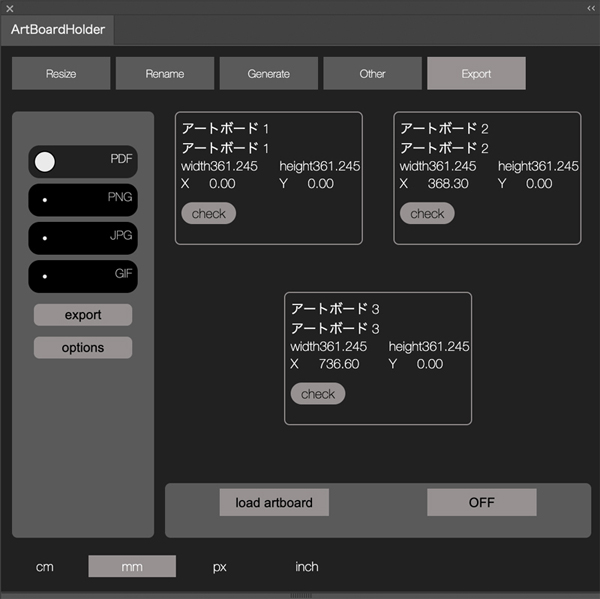
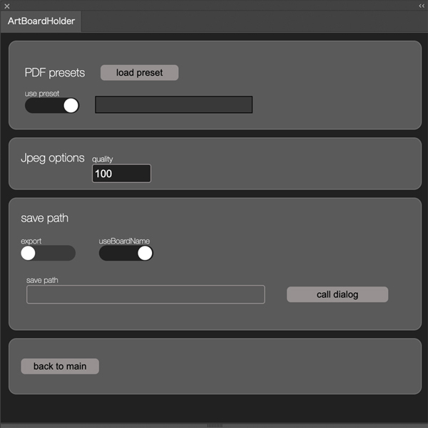

# Illustrator Extension Artboardholder

the Extension for Illustrator manages artboards
like resize , rename , generate , etc...
I had developed some ExtendScripts for sorting artboard but it was messed up bit so I unified those scripts on the panel.  
details are below.

**[Japanese explanation is here](https://kawano-shuji.com/justdiary/2021/11/25/illustrator-extension-artboardholder/)**

## common

you can load current artboards data just push load button.
it has also load event which loads artboards when you switch active document on Illustrator automatically.
if you want to use event , push the OFF button next to the load button. and event will be dispatched.
but it won't reload when you edit document even if you turn on the event button.
artboards has their own data on panel , like size , position of x y , name and renamed name(I explain how you rename it later) and it has check button as well (it refers wheather it will be target of process).

## Resize

literally resize artboards.
it can resize artboard and it can adjust size as well(like expand or shrink).
fill ou number box as you want to resize or adjust number of size.
in case you push the resize button . it resizes artboards. but in case of you push the adjust button . it adjusts size from origin of artboard's size.

## Rename

rename artboards.
you would notice it renames on RegExp system so you need knowledge of it but it also has preset.
so in certain case , you don't need to write RegExp form.
and some options are below

1. **replace**
replace text.

2. **addtext**
add text at the head of name.

3. **addSequence**
add sequence number , at the head of name.

4. **global**
global option for RegExp.

5. **ignore**
ignore case. this is option for RegExp.

6. **presets**
you can choice some presets here.

## Generate

generate artboards.
it generates artboards quickly as you like.
it has three ways of generate it.

1. **Group**

it generates from group items you select.

2. **path item**

it generates from path items you select.

## other

some other features. like showing cross hair or something.

1. **center**
showing center mark on artboard. if already it was shown , it hides.

2. **cross hair**
showing cross hair. if already it was shown , it hides.

3. **safe area**
showing safe area. if already it was shown , it hides..

4. **.fit items**
resizing artboard size along items on artboard.

## Export

exporting images as a PDF , GIF , PNG , JPG ...  
you can choice some few options.

### options

1. **preset**
you can choice your own PDF preset.

2. **jpeg quality**
quality of jpeg image.

3. **save path**
you can choice directory you want to save images. dialog button calls dialog window.

## download zxp

**[download zxp file from here](https://kawano-shuji.com/strage/ArtBoardHolder.zxp)** 